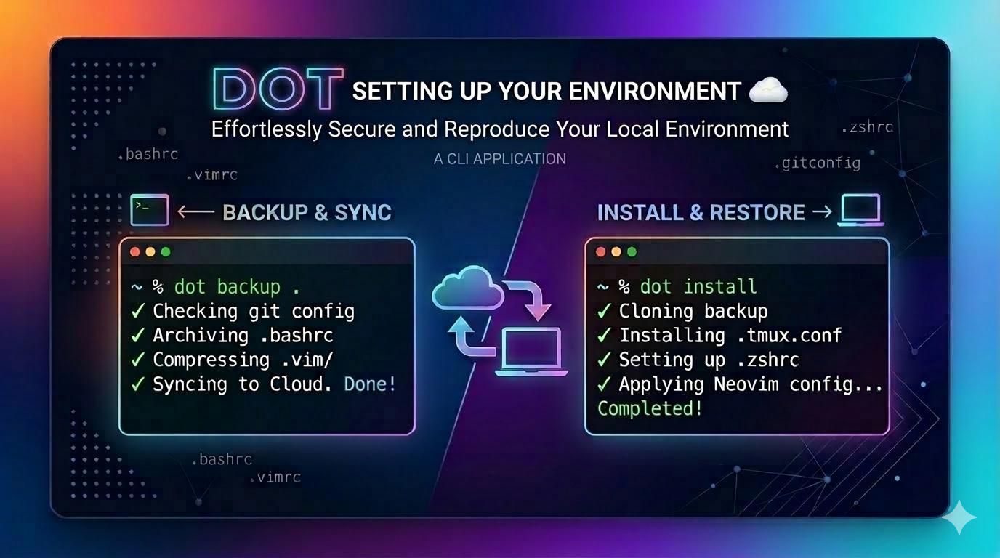

# dot

A TypeScript CLI tool to install and backup your dotfiles from a Git repository.

## Commands

| Command | Description |
|---|---|
| `dot setup` | Create an example `dot.yaml` in your dotfiles directory |
| `dot install <repo-url>` | Clone a dotfiles repo and install its contents onto the system |
| `dot install --local <path>` | Install from an existing local repository (no clone/pull) |
| `dot backup` | Copy system dotfiles back into the local repo and commit |

---

## Getting Started

### 1. Install the CLI

```bash
npm install -g dot
```

### 2. Initialise your dotfiles directory

```bash
dot setup
# or specify a custom path
dot setup --dir ~/projects/dotfiles
```

This creates `~/.dotfiles/dot.yaml` with an example configuration and commented-out templates.  
The generated file already includes an entry for `dot.yaml` itself so your configuration is always backed up alongside your other dotfiles.

### 3. Edit `dot.yaml`

Open `~/.dotfiles/dot.yaml` and declare your dotfiles and packages:

```yaml
dotfiles:
  # dot.yaml itself is tracked so it is always backed up
  - source: dot.yaml
    target: ~/.dotfiles/dot.yaml

  - source: .zshrc
    target: ~/.zshrc

  - source: .gitconfig
    target: ~/.gitconfig

  - source: .config/nvim
    target: ~/.config/nvim

packages:
  brew:
    - neovim
    - zsh
    - starship
  npm:
    - typescript
```

### 4. Push to a Git remote

```bash
cd ~/.dotfiles
git init && git remote add origin https://github.com/you/dotfiles.git
git add . && git commit -m "init"
git push -u origin main
```

### 5. Install on a new machine

```bash
dot install https://github.com/you/dotfiles.git
```

---

## Command Reference

### `dot setup [options]`

Creates an example `dot.yaml` in the dotfiles directory.

| Option | Default | Description |
|---|---|---|
| `-d, --dir <path>` | `~/.dotfiles` | Directory where `dot.yaml` will be created |
| `-f, --force` | `false` | Overwrite an existing `dot.yaml` |

```bash
dot setup
dot setup --dir ~/dotfiles
dot setup --force   # overwrite existing config
```

---

### `dot install [repo-url] [options]`

Clones (or pulls) a dotfiles repository, installs declared packages, then symlinks (or copies) each dotfile to its target on the system.

Provide either a `<repo-url>` argument **or** the `--local <path>` option — at least one is required.

| Option | Default | Description |
|---|---|---|
| `-d, --dir <path>` | `~/.dotfiles` | Local directory to clone the repo into |
| `-l, --local <path>` | — | Use an existing local repository at this path (skips clone/pull) |
| `-c, --copy` | `false` | Copy files instead of creating symlinks |
| `--skip-packages` | `false` | Skip package manager installation |

```bash
# Remote repository
dot install https://github.com/you/dotfiles.git
dot install https://github.com/you/dotfiles.git --copy
dot install https://github.com/you/dotfiles.git --skip-packages
dot install https://github.com/you/dotfiles.git --dir ~/my-dots

# Existing local repository (no network required)
dot install --local ~/projects/dotfiles
dot install --local ~/projects/dotfiles --copy
dot install --local ~/projects/dotfiles --skip-packages
```

**Conflict behaviour:** if a file or symlink already exists at a target path it is removed and replaced. Directories are recreated automatically.

---

### `dot backup [options]`

Copies each system dotfile back into the local repository at its declared `source` path, then commits and pushes the changes.

| Option | Default | Description |
|---|---|---|
| `-d, --dir <path>` | `~/.dotfiles` | Path to the local dotfiles repository |
| `-m, --message <msg>` | `backup: YYYY-MM-DD` | Git commit message |
| `--no-push` | `false` | Commit locally without pushing |

```bash
dot backup
dot backup --message "add nvim config"
dot backup --no-push
dot backup --dir ~/my-dots
```

---

## `dot.yaml` Reference

```yaml
dotfiles:
  - source: <path-in-repo>   # relative to repo root
    target: <system-path>    # ~ is expanded to $HOME

packages:
  brew:   [neovim, zsh]      # macOS — Homebrew
  npm:    [typescript]       # npm global install
  pip:    [black]            # pip install
  apt:    [neovim, zsh]      # Debian/Ubuntu — apt-get
```

---

## Development

```bash
npm install        # install dependencies
npm run build      # compile TypeScript → dist/
npm run dev        # run via ts-node (no build required)
npm test           # run Jest test suite
npm run clean      # remove dist/
```

## Project Structure

```
src/
├── index.ts               # CLI entry point (Commander)
├── types/
│   └── index.ts           # Shared TypeScript interfaces
├── commands/
│   ├── setup.ts           # setup command
│   ├── install.ts         # install command
│   └── backup.ts          # backup command
└── utils/
    ├── config.ts          # Read/write dot.yaml (js-yaml)
    ├── files.ts           # Symlink/copy helpers, home expansion
    ├── git.ts             # Clone, pull, commit, push (simple-git)
    ├── packages.ts        # brew / npm / pip / apt installers (zx)
    └── logger.ts          # Terminal output (chalk + ora)
```
